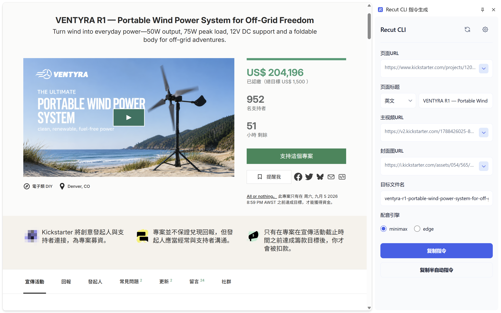

# Recut CLI 指令生成 · Recut CLI Command Generator

[Recut CLI](https://github.com/windstudio/recut-cli) 的配套工具：帮助你在浏览网页时获取视频信息、拼接生成 Recut CLI 的指令。

Chrome 扩展（Manifest V3）——点击图标打开侧边栏，自动从当前网页提取主视频与封面图，编辑后一键生成并复制指令。

A companion tool for [Recut CLI](https://github.com/windstudio/recut-cli): grab video info while browsing and assemble ready-to-run Recut CLI commands.

A Chrome extension (Manifest V3) — click the icon to open a side panel that auto-extracts the main video and cover image from the current page, then generates and copies the command with one click.

---

## ✨ 功能特性

- 📌 点击扩展图标打开侧边栏，自动提取当前页面的 URL、标题、主视频、封面图
- 🎬 内置 Kickstarter 项目页规则：视频源按 `_high.mp4` > `.m3u8` > 首个 source 的优先级选取
- 🔧 其他网站支持自定义站点规则（视频/封面标签的 id 或 class），按域名保存到本地
- ✏️ 标题、目标文件名可在生成前编辑；中英文标题自动切换 `--title` / `--chs-title`
- 📋 一键复制完整指令或半自动指令（追加 `--pause-on-chs-script`）
- 🔒 全部处理在本地完成：不发起任何网络请求，不收集、不上传任何数据

## 📦 前置依赖

- 本地已安装 [Recut CLI](https://github.com/windstudio/recut-cli)（本扩展只负责生成并复制指令，实际处理由 CLI 完成）
- Chrome / Edge 等支持 Manifest V3 Side Panel 的浏览器

## 🚀 安装（开发者模式）

1. 下载或克隆本仓库：
   ```bash
   git clone https://github.com/windstudio/recut-crx.git
   ```
2. 打开浏览器扩展管理页 `chrome://extensions`（Edge 为 `edge://extensions`）
3. 开启右上角「开发者模式」
4. 点击「加载已解压的扩展程序」，选择本仓库根目录
5. 在任意网页点击工具栏中的扩展图标即可打开侧边栏

## 🎯 使用方法

1. 打开 Kickstarter 项目页（或其他已配置规则的页面）
2. 点击扩展图标，侧边栏自动完成提取
3. 按需修改标题、目标文件名、语言、配音引擎
4. 点击「复制指令」或「复制半自动指令」，粘贴到终端执行

生成的指令格式：

```
recut "<pageUrl>" [-o <outputFile>] --video-url "<videoUrl>" [--image "<imageUrl>"] (--title|--chs-title) "<pageTitle>" --tts-engine <minimax|edge>
```

- 语言选择「中文」时使用 `--chs-title`，否则使用 `--title`
- 未提取到封面图时自动省略 `--image` 参数
- 半自动指令在末尾追加 `--pause-on-chs-script`

## ⚙️ 自定义站点规则

非 Kickstarter 页面首次提取时，会提示进入「规则配置」：

1. 用浏览器开发者工具找到目标页面的主视频与封面图元素
2. 在配置表单中选择定位方式并填入对应值：
   - **主视频**：`<video>` 标签的 id 或 class
   - **封面图**：只需填标签的 id 或 class——程序优先查找对应 `` 取其 `src`，找不到则读取该 id/class 元素的 CSS 背景图（`background-image`，相对路径自动还原为绝对地址），无需区分标签类型
3. 保存后按域名生效，下次打开自动回显

> Kickstarter 项目页内置规则为 `video.z1` / `img.z3`，无需配置。

## 🖼 截图



## 🧱 项目结构

```
├── manifest.json            # 扩展清单 (Manifest V3)
├── background/
│   └── service-worker.js    # 消息中转与内容脚本注入
├── content/
│   └── content.js           # 页面内容提取
├── sidepanel/
│   ├── sidepanel.html       # 侧边栏界面（内联样式）
│   └── sidepanel.js         # 侧边栏交互逻辑
└── shared/constants.js      # 共享常量（消息协议、存储键、内置规则）
```

纯静态扩展，无构建步骤；修改代码后在扩展管理页点击刷新即可生效。

## 📄 许可证

[MIT](./LICENSE)

---

## English

A Chrome extension (Manifest V3): click the toolbar icon to open a side panel, automatically extract the page URL, title, main video, and cover image from the current tab, edit as needed, and copy a ready-to-run Recut CLI command.

### Features

- Auto-extracts page URL, title, main video, and cover image into a side panel
- Built-in rules for Kickstarter project pages (video source priority: `_high.mp4` > `.m3u8` > first source)
- Custom per-domain rules for any other site (id/class of the video & image tags)
- Editable title and output file name; language switch toggles `--title` / `--chs-title`
- One-click copy of the full command or the semi-auto variant (`--pause-on-chs-script`)
- Fully local: no network requests, no analytics, nothing uploaded

### Prerequisites

- The [Recut CLI](https://github.com/windstudio/recut-cli) installed locally — this extension only generates the command
- A browser supporting Manifest V3 Side Panel (Chrome / Edge)

### Install (Developer Mode)

```bash
git clone https://github.com/windstudio/recut-crx.git
```

Then open `chrome://extensions`, enable **Developer mode**, click **Load unpacked**, and select the cloned folder.

### Usage

1. Open a Kickstarter project page (or any page covered by your custom rule)
2. Click the extension icon — the side panel extracts automatically
3. Adjust title, output file name, language, or TTS engine
4. Click **Copy command** and paste it into your terminal

### Custom Site Rules

For non-Kickstarter pages, the panel opens a config form on first use:

1. Inspect the target page's main video and cover elements in DevTools
2. Fill in the config form:
   - **Main video**: id or class of the `<video>` tag
   - **Cover**: just the id or class — the extension first looks for a matching `` and uses its `src`; if none is found, it reads the CSS background-image of the element with that id/class (relative URLs are resolved automatically)
3. Rules apply per domain and are echoed back when reopened

> Kickstarter project pages ship with built-in rules (`video.z1` / `img.z3`) — no configuration needed.

### Screenshot


### Privacy

Everything runs locally in your browser. Rules are saved to `chrome.storage.local`; no network requests are made and no data is collected.

### License

[MIT](./LICENSE)
